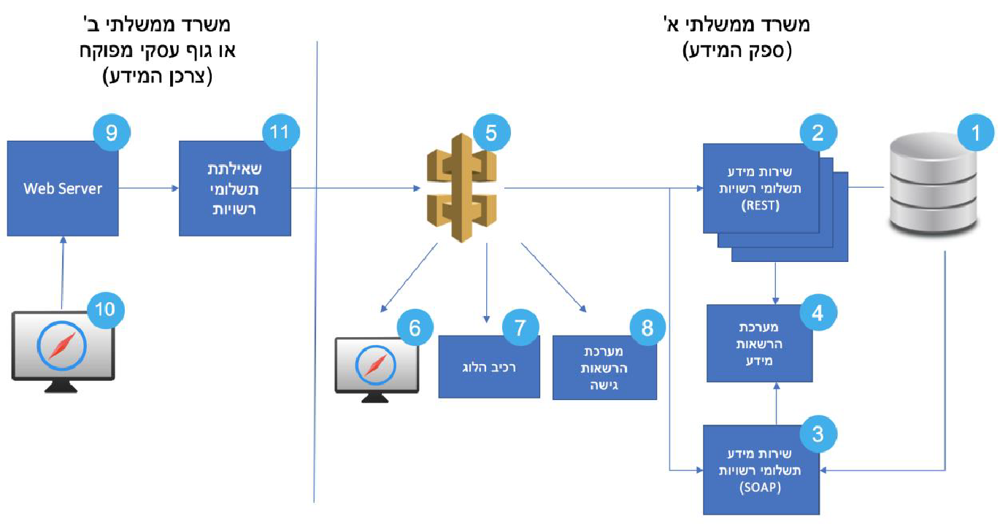

# demogovil
Here are the scenarios and their current status

## System Context


## Overview
Nearly all scenarios begin by performing an oauth login. I am doing the following command now to fetch an
access token ( you can obviously do this from a rest client if you prefer ).

```bash
curl -s -u client_key:secret http://demo24-test.apigee.net/oauth/token?grant_type=client_credentials | fgrep access_token | awk -F '"' '{print $4}'

```

Where client_key and secret are found in the app. You'll find the scenario1_app located under developer apps in the ui. Check there and then locate the key and secret to perform the login.

With this fetched you can then call the other services in the different scenarios.


## Breakdown of the various scenarios
- :heavy_check_mark: [scenario1](/scenario1)
- :heavy_checkmark: [scenario2](/scenario2)
- :heavy_checkmark: [scenario3](/scenario3)
- :red_circle: [scenario4](/scenario4)
- :heavy_checkmark: [scenario5_LoadBalancing](/scenario5)
- :heavy_checkmark: [scenario5_SLA](/scenario5)
- :red_circle: [scenario6](/scenario6)
- :red_circle: [scenario7](/scenario7)
- :red_circle: [scenario8](/scenario8)
- :red_circle: [scenario9](/scenario9)
